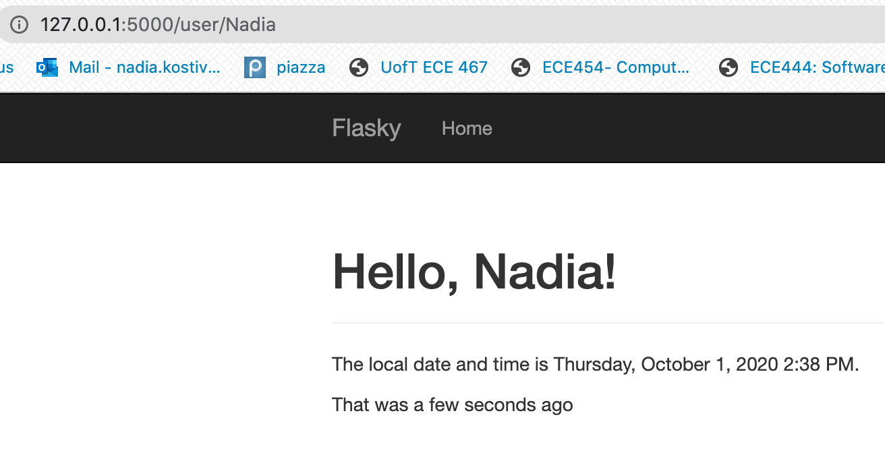
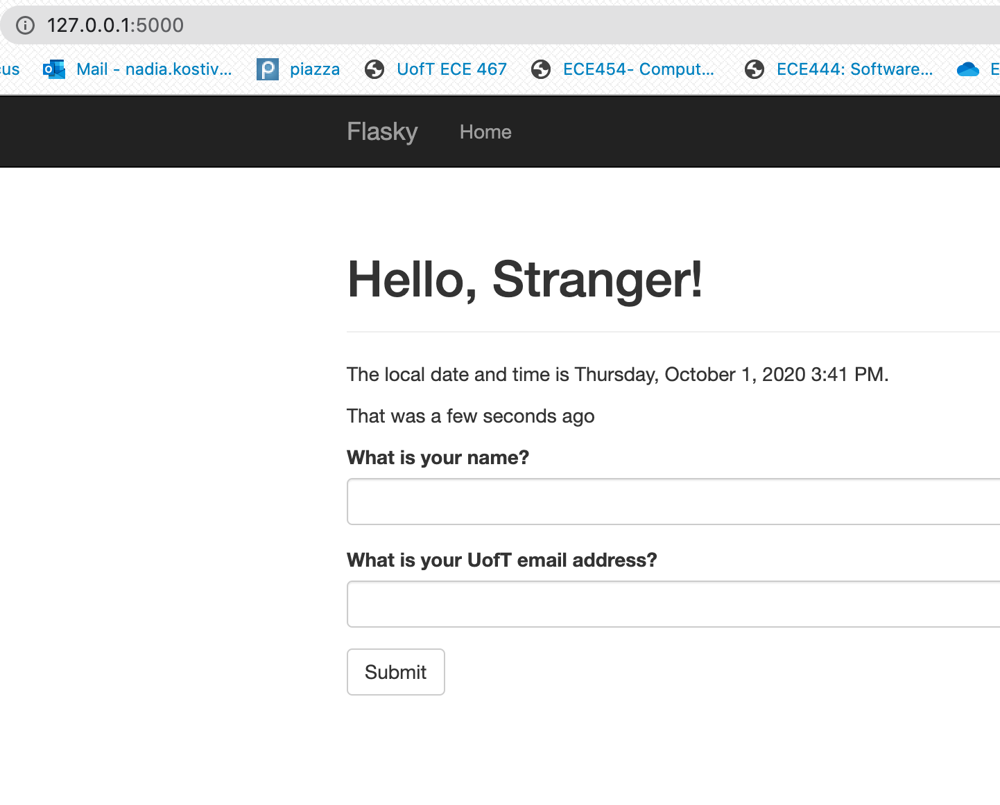
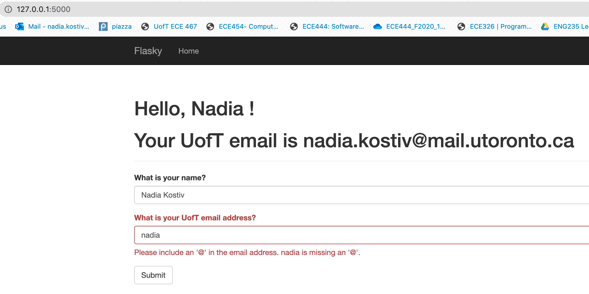
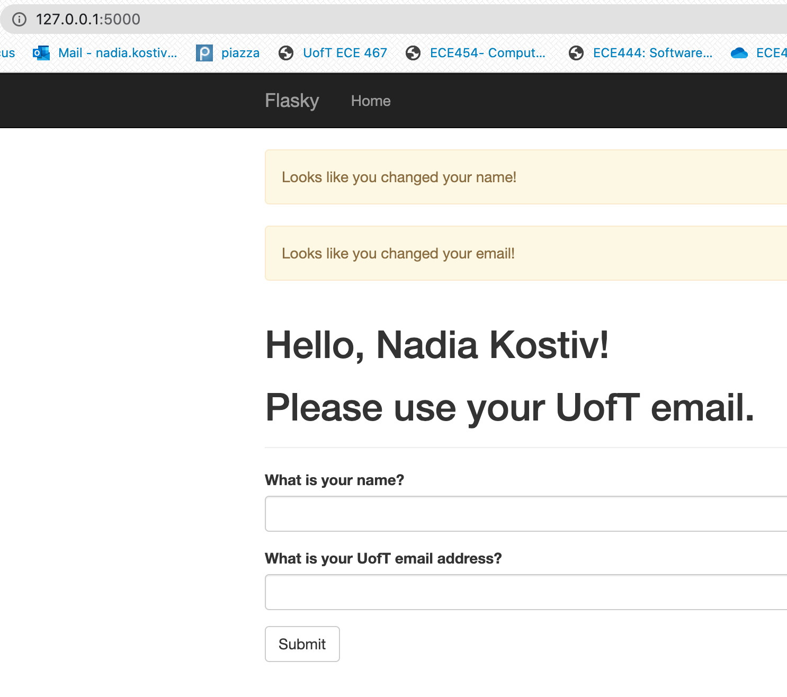

# ECE444-F2020-Lab3

Nadia Kostiv 

this repo is a clone of
https://github.com/miguelgrinberg/flasky

**Activity 1:**

**Activity 2:**

**Activity 3:**

An SQL database is relational- it stores ordered data in tables. Tables have primary keys to uniquely identify each row, and foreign keys, which reference other rows in the database. These links create relationships between database entries.

A noSQL database is non-relational- it uses collections and documents, rather than records. The data stored is much less structured, and joining differeny entries becomes difficult. Due to the lack of structure, these can sometimes have a performance increase compared to SQL databases.
