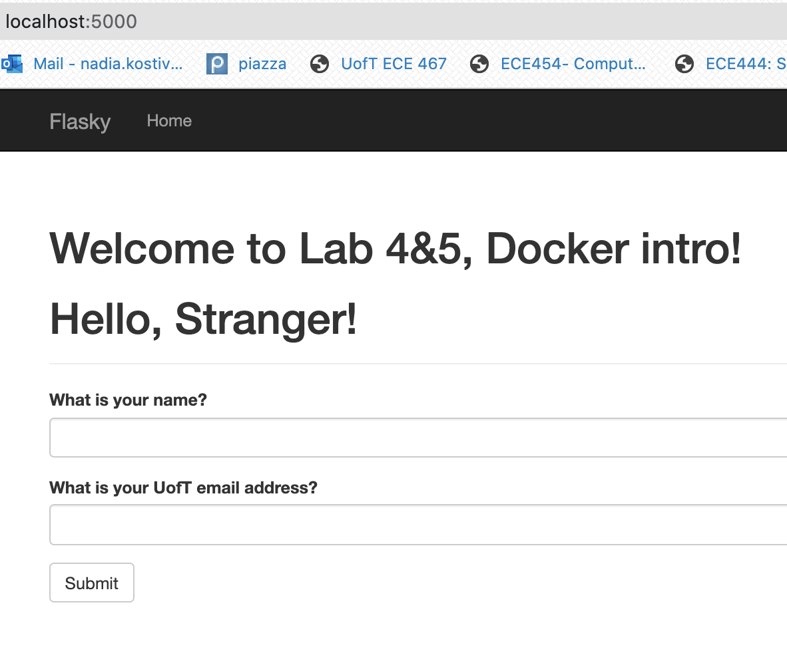

# ECE444-F2020-Lab4&5

Nadia Kostiv 

this repo is a clone of
https://github.com/miguelgrinberg/flasky

**To build and run the system:**

- The Dockerfile is located inside the root directory `ECE444-F2020-Lab3/`

- To build your image, use a command similar to this inside the root directory: `docker build --tag hello:latest .` 

- Then, to run your image as a container: `docker run --publish 5000:5000 --name dockertest hello:latest`

**The difference between Docker and a Virtual Machine:**

Docker runs containers, which are run natively on Linux and share the kernel of the host machine with other containers.
A Vitual Machine runs as an entire guest operating system, using the virtual resources of its host. 
A container is therefore much more lightweight than a VM, and can be started in just seconds, while a VM can take minutes to spin up.
A VM provides full OS isolation with guaranteed resources, while Docker just isolate one process from another. 

